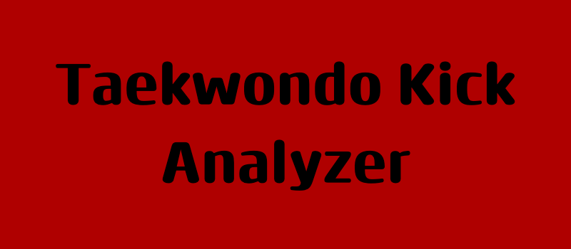
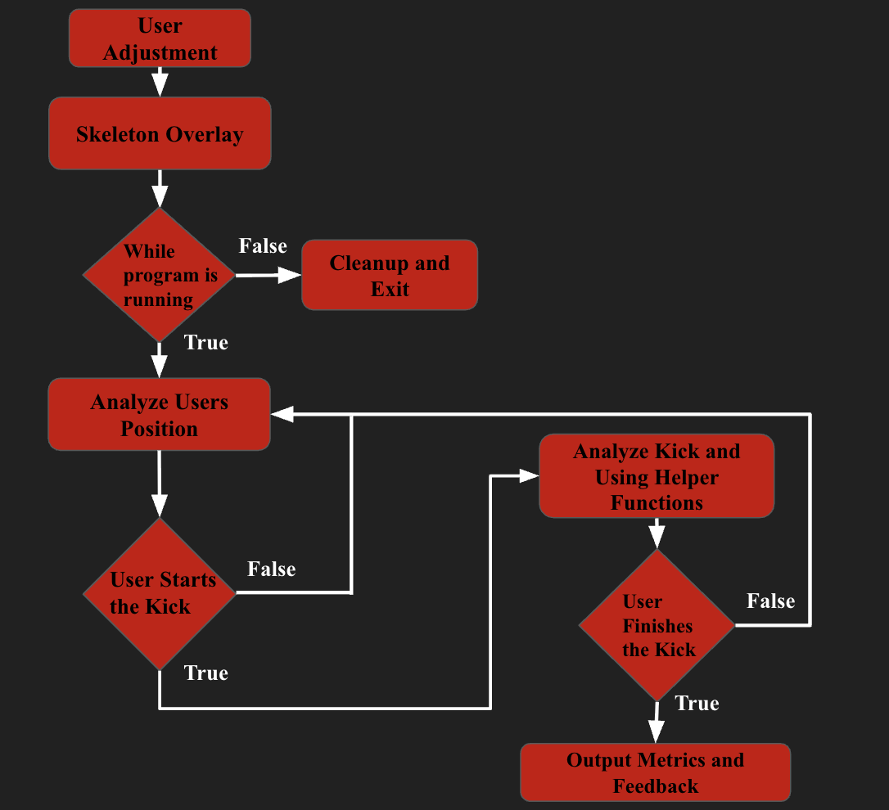

This is a program that I use to help improve my kicks. It utilizes packages like NumPy, MediaPipe, and OpenCV for an accurate analysis. It creates an outline of your body and analyzes the joints as you kick. This allows it to give accurate metrics and helps emphasize what I need to focus on to improve.

## Features

- **Full Body Detection**: Analyzes the entire body and creates a skeleton overlay for visualization of the user
- **Real-time Feedback**: Accurately gives feedback, metrics, and improvement steps in real time as you're kicking in a clear format
- **Dynamic Kick Height Detection**: Locates the chest height of the kicker and changes its values according to their height, allowing for proper calculations and feedback, no matter their height and proportions
-  **Angle Calculation**: Calculates the angle and extension for your joints, like the hips, knees, and ankle, to give accurate metrics about your form
-  **Speed Tracking**: Tracks the speed of your kick and helps ensure your movements are practical in a real taekwondo sparring match
-  **Adjustment Timer**: Has a 10-second visual timer when you start, as this allows the user to fix their position and ensure their full body is in frame

## Taekwondo Kick Analyzer Flow Chart



## Understanding The Program

There are a few things that must be understood before using the program:
  1. **Adjustment**: This program was created to work for people of all heights. Due to this, I created a 10-second timer when the program starts that allows the user to get into position. During this time, the user needs to stand up straight, face the screen directly, and ensure all their limbs are shown. Once the timer is finished, a green dot will appear at your chest height. This green dot will be used as the threshold for your kicking height. A threshold is also created in relation to your feet. Because of this, it is important not to move closer/further from the screen as it can lead to inaccurate metrics.  
  2. **Kicking**: You can now turn 90 degrees in either direction and perform your kick. The program will start analyzing at the start of the kick and stop when the kick finishes. Please note that there is a 0.5-second cooldown time between analyses to prevent inaccurate results.
  3. **Results**: Once the kick is finished, the results will be printed in the terminal. At this point, you can either view your results or continue kicking to create more results. To end the program, click the **q** key.

## Quick Start

### 1. Install Dependencies

```bash
pip install -r requirements.txt
```

### 2. Edit Threshold Variables

```bash
chest_dot_position = None
speed_threshold = 0.6 # Max duration (seconds) to consider a kick fast

start_time = time.time()
countdown_seconds = 10
...
```

If the threshold variables are not to your liking, you may adjust them

### 3. Run main.py

Run main.py to start the program.

## Status

Currently, there is a problem with the speed calculations. I am currently working to fix that, so please be patient!


## Future Features
  - **More Kicks**: Adding more kicks instead of just a front snap kick. This way, it can help give feedback for other kicks. 
  - **Better UI**: Update the UI to be clearer and have more configurations
  - **More Metric Calculations**: Get more metrics for better accuracy and feedback

## License

MIT License - see LICENSE file for details.

